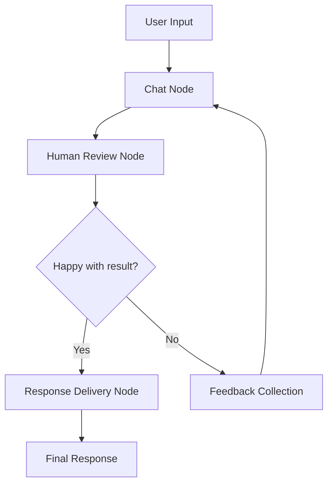

# 🎤 Voice-Enabled Chatbot with Human-in-the-Loop

> *An intelligent conversational AI assistant that combines the power of LangGraph workflows, Deepgram voice technology, and human oversight for the ultimate chat experience.*

[](https://python.org)
[](https://langchain.com/langgraph)
[](https://deepgram.com)
[](https://streamlit.io)

## 🌟 What Makes This Special?

This isn't just another chatbot. It's a **voice-first, human-supervised AI assistant** that ensures every response meets your standards before delivery. Built with enterprise-grade LangGraph workflows and powered by Deepgram's cutting-edge voice AI.

### ✨ **The Magic Happens Here:**
- 🗣️ **Speak naturally** - No typing required, just talk
- 👂 **Listen to responses** - Every AI message becomes natural speech  
- 👤 **Human quality control** - You approve every response before it's sent
- 🔄 **Iterative improvement** - Provide feedback to make responses better
- 🎭 **Multiple personalities** - Choose from 10+ different AI voices

---

## 🚀 **Key Features**

### 🎤 **Voice-First Experience**
```
🗣️ You speak → 🤖 AI understands → 💭 AI responds → 👂 You listen → ✅ You approve
```

- **Natural Speech Input**: Powered by Deepgram's Nova-2 model
- **High-Quality TTS**: Aura voices with human-like intonation
- **Real-time Processing**: Sub-second latency for seamless conversations
- **Voice Commands**: Control the entire interface with your voice

### 👤 **Human-in-the-Loop (HITL) Workflow**

**The Simple Question That Changes Everything:**
> *"😊 Are you happy with this result?"*

- **Yes** → Response approved and delivered ✅
- **No** → "💭 What would you like to change or add?" → AI improves → Repeat

**Why This Matters:**
- 🎯 **Quality Assurance**: Every response meets your standards
- � **SContinuous Learning**: AI gets better with your feedback
- 🛡️ **Risk Mitigation**: No unwanted or inappropriate responses
- 🎨 **Customization**: Responses tailored to your preferences

### 💬 **Enhanced Chat Experience**

- **🧠 Persistent Memory**: Conversations continue across sessions
- **🎵 Individual Audio**: Each message has its own unique audio
- **⚡ Real-time Interface**: Responsive Streamlit-based UI
- **📊 Session Analytics**: Track your conversation statistics
- **🔄 Smart Regeneration**: AI learns from rejections and feedback

---

## 🏗️ **Architecture & Design**

### **LangGraph Workflow Engine**


### **Core Components**

| Component | Purpose | Technology |
|-----------|---------|------------|
| **Chat Node** | AI response generation | OpenAI GPT-3.5-turbo |
| **Human Review Node** | HITL approval workflow | Custom logic + Voice commands |
| **Response Delivery Node** | Final response with audio | Deepgram Aura TTS |
| **Voice Integration** | Speech processing | Deepgram Nova-2 + Aura |
| **State Management** | Conversation persistence | LangGraph TypedDict |

### **State Architecture**
```python
class ChatState(TypedDict):
    messages: List[BaseMessage]           # Conversation history
    pending_response: Optional[str]       # Response awaiting approval
    human_approval: Optional[bool]        # Approval status
    human_feedback: Optional[str]         # Improvement suggestions
    voice_enabled: bool                   # Voice features toggle
    selected_voice: str                   # Chosen voice model
    message_audios: Dict[str, bytes]      # Individual message audio
```

---

## 🛠️ **Quick Start**

### **Prerequisites**
- Python 3.8+
- OpenAI API key
- Deepgram API key ([Get free credits](https://deepgram.com))

### **Installation**
```bash
# Clone and navigate
git clone <repository>
cd voice-chatbot-hitl

# Install dependencies
pip install -r requirements.txt

# Configure API keys in .env
OPENAI_API_KEY=your_openai_key_here
DEEPGRAM_API_KEY=your_deepgram_key_here
```

### **Launch Options**

#### 🖥️ **Web Interface (Recommended)**
```bash
streamlit run streamlit_voice_chatbot.py
```
*Opens at: http://localhost:8501*

#### 💻 **Command Line Interface**
```bash
python app.py
```

---

## 🎯 **How to Use**

### **1. Start a Conversation**
- **Type** your message in the chat input
- **OR** click 🎤 and speak your message
- **OR** use voice commands throughout

### **2. AI Generates Response**
- GPT-3.5-turbo processes your input
- Response appears for your review
- No automatic delivery - you're in control

### **3. Human Review Process**
```
🤖 AI Response appears
     ↓
😊 "Are you happy with this result?"
     ↓
✅ YES → Response delivered to chat
❌ NO → "What would you like to change?"
     ↓
💭 Provide feedback → AI regenerates → Review again
```

### **4. Voice Features**
- **🔊 Listen**: Click to hear any message as speech
- **🎤 Voice Commands**: Say "approve", "reject", "listen"
- **🗣️ Voice Input**: Speak instead of typing
- **🎭 Voice Selection**: Choose from 10+ different voices

---

## 🎤 **Voice Models Available**

### **Female Voices**
- `aura-asteria-en` - Natural and conversational
- `aura-luna-en` - Warm and friendly  
- `aura-stella-en` - Confident and clear
- `aura-athena-en` - Authoritative and professional
- `aura-hera-en` - Expressive and engaging

### **Male Voices**
- `aura-orion-en` - Deep and resonant
- `aura-arcas-en` - Smooth and polished
- `aura-perseus-en` - Strong and commanding
- `aura-angus-en` - Friendly and approachable
- `aura-orpheus-en` - Melodic and artistic

---

## 📁 **Project Structure**

```
voice-chatbot-hitl/
├── 🚀 streamlit_voice_chatbot.py    # Main web interface
├── 💻 app.py                        # CLI interface  
├── 🧠 state.py                      # Chat state management
├── ⚙️ nodes.py                      # LangGraph workflow nodes
├── 🎤 voice_integration.py          # Deepgram voice processing
├── 📋 requirements.txt              # Python dependencies
├── 🔐 .env                          # API keys configuration
└── 📖 README.md                     # This documentation
```

### **Key Files Explained**

#### **🚀 streamlit_voice_chatbot.py**
The crown jewel - a full-featured web interface with:
- Real-time voice input/output
- Visual HITL workflow
- Individual message audio players
- Session management and statistics

#### **🧠 state.py** 
Defines the conversation state structure using LangGraph's TypedDict pattern with reducers for:
- Message history accumulation
- Audio storage per message
- HITL approval tracking

#### **⚙️ nodes.py**
Contains the three core workflow nodes:
- `chat_node()` - AI response generation with feedback integration
- `human_review_node()` - Simplified HITL approval process
- `response_delivery_node()` - Final response delivery with audio

#### **🎤 voice_integration.py**
Handles all Deepgram interactions:
- Text-to-speech with multiple voice models
- Speech-to-text for voice input
- Voice command processing
- Error handling and fallbacks

---

## 🔧 **Advanced Configuration**

### **Voice Settings**
```python
# In streamlit interface
voice_model = st.selectbox("Voice Model", [
    "aura-asteria-en",  # Default
    "aura-luna-en",     # Warm
    "aura-orion-en",    # Deep male
    # ... more options
])
```

### **HITL Customization**
```python
# Modify human_review_node() in nodes.py
def human_review_node(state: ChatState):
    # Add custom approval logic
    # Integrate with external systems
    # Add sentiment analysis
    # Implement A/B testing
```

### **Voice Command Extensions**
```python
# In voice_integration.py
approve_patterns = [
    "approve", "yes", "accept", "good", 
    "send it", "looks good", "perfect"  # Add custom patterns
]
```

---

## 🎯 **Use Cases & Applications**

### **🏢 Business Applications**
- **Customer Service**: Quality-controlled AI responses
- **Content Creation**: Voice-guided content generation
- **Training**: AI response improvement through feedback
- **Accessibility**: Voice interface for disabled users

### **👨‍💻 Developer Applications**  
- **Code Review**: AI explanations with human oversight
- **Documentation**: Voice-generated docs with approval
- **Debugging**: Conversational problem-solving
- **Learning**: Interactive programming tutorials

### **🎓 Educational Applications**
- **Tutoring**: Supervised AI teaching assistance
- **Language Learning**: Voice practice with corrections
- **Research**: Guided information gathering
- **Presentations**: Voice-controlled slide generation

---

## 🔒 **Security & Privacy**

### **Data Protection**
- ✅ **No Local Storage**: Voice data processed in real-time
- ✅ **API Security**: Secure token-based authentication
- ✅ **Human Oversight**: All responses reviewed before delivery
- ✅ **Error Handling**: Graceful fallbacks when services fail

### **Privacy Features**
- 🔐 **Encrypted Communication**: HTTPS/WSS for all API calls
- 🗑️ **No Persistence**: Audio data not stored locally
- 👤 **User Control**: Complete control over response approval
- 🛡️ **Safe Defaults**: Conservative settings out of the box

---

## 🚀 **What's Next?**

### **Planned Enhancements**
- 📊 **Analytics Dashboard**: Approval rates, voice usage stats
- 🌍 **Multi-language Support**: International voice models
- 🤖 **Custom AI Models**: Fine-tuned models for specific domains
- 👥 **Multi-user Support**: Team collaboration features
- 📱 **Mobile App**: Native iOS/Android applications

### **Integration Opportunities**
- 💾 **Database Storage**: Persistent conversation history
- 🔗 **API Endpoints**: RESTful API for external integrations
- 📈 **Business Intelligence**: Advanced analytics and reporting
- 🎨 **Custom Themes**: Branded interface customization

---

## 🤝 **Contributing**

We welcome contributions! Here's how you can help:

1. **🐛 Bug Reports**: Found an issue? Open a GitHub issue
2. **💡 Feature Requests**: Have an idea? Let's discuss it
3. **🔧 Code Contributions**: Fork, develop, and submit PRs
4. **📖 Documentation**: Help improve our docs
5. **🎤 Voice Models**: Test and recommend new voice options

### **Development Setup**
```bash
# Fork the repository
git clone your-fork-url
cd voice-chatbot-hitl

# Create development environment
python -m venv venv
source venv/bin/activate  # or venv\Scripts\activate on Windows

# Install development dependencies
pip install -r requirements.txt
pip install -r requirements-dev.txt  # If available

# Run tests
python -m pytest tests/
```

## 🙏 **Acknowledgments**

### **Inspiration & Learning Sources**
This project was inspired by and learned from:
- **`chatbot-in-langgraph-main/`** - Our teacher folder for LangGraph patterns
- **LangChain Community** - For the amazing framework and examples
- **Deepgram Team** - For the incredible voice AI technology
- **Streamlit Community** - For the beautiful and simple web framework

### **Special Thanks**
- 🎤 **Deepgram** for providing cutting-edge voice AI
- 🦜 **LangChain** for the powerful LangGraph framework  
- 🚀 **Streamlit** for making beautiful UIs simple
- 🤖 **OpenAI** for the conversational AI capabilities

---

## 📞 **Support & Contact**

- 📧 **Email**: [akshug2004@gmail.com]

---

<div align="center">

### **Ready to revolutionize your AI conversations?**

---

*Built with ❤️ by developers, for developers*

**🎤 Voice-First • 👤 Human-Supervised • 🚀 Production-Ready**

</div>
